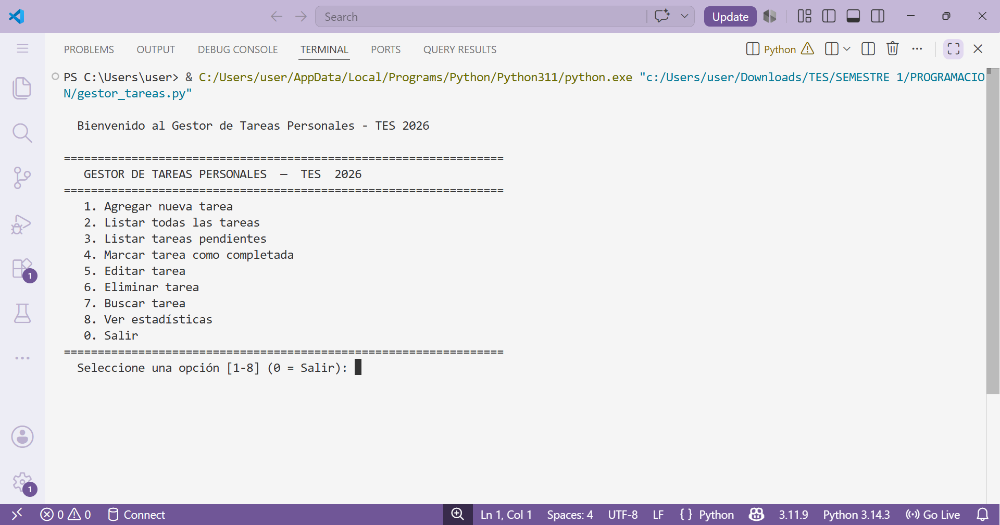

# TaskFlow - Personal Task Manager


## Overview

TaskFlow is a command-line personal task management application developed in Python while participating in Stanford Code in Place 2026 (CIP2026) and simultaneously studying Web Application Development at TES University in Guayaquil, Ecuador.

The project was created to apply programming concepts learned through both academic experiences and demonstrates practical use of Python fundamentals in a real-world productivity tool.

## Screenshot



## Features

- Create new tasks
- Edit existing tasks
- Delete tasks
- Mark tasks as completed
- Search tasks by keyword
- Filter pending tasks
- Assign priority levels (High, Medium, Low)
- Generate productivity statistics
- Persistent storage using text files
- Input validation
- Exception handling
- Interactive menu-driven interface

## Concepts Applied

This project demonstrates the use of:

- Functions and modular programming
- Lists and dictionaries
- File handling
- Exception handling
- Input validation
- Data persistence
- Conditional statements
- Loops
- Custom classes
- Program organization and structure

## Project Structure

```text
taskflow-personal-task-manager/
│
├── gestor_tareas.py
├── tareas.txt
├── README.md
└── LICENSE
```

## How to Run

### Requirements

- Python 3.x

### Execute

```bash
python gestor_tareas.py
```

## Sample Menu

```text
1. Add new task
2. List all tasks
3. List pending tasks
4. Mark task as completed
5. Edit task
6. Delete task
7. Search task
8. View statistics
0. Exit
```

## Learning Experience

This project represents one of my first complete software applications developed entirely in Python.

While participating in Stanford Code in Place 2026, I also began my first semester in a Web Application Development program. Building TaskFlow allowed me to reinforce programming fundamentals and gain practical experience designing, organizing, and maintaining a functional software project.

## Acknowledgments

- Stanford University – Code in Place 2026 (CIP2026)
- Instituto Superior Universitario Espíritu Santo (TES)
- Professor Yessica María Armijos Farez

## Author

Ronald Vera Quiles

Ecuador • 2026
